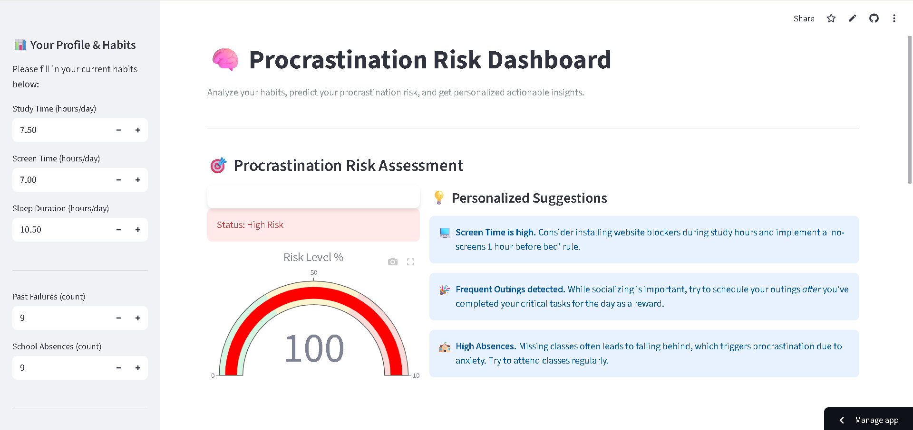
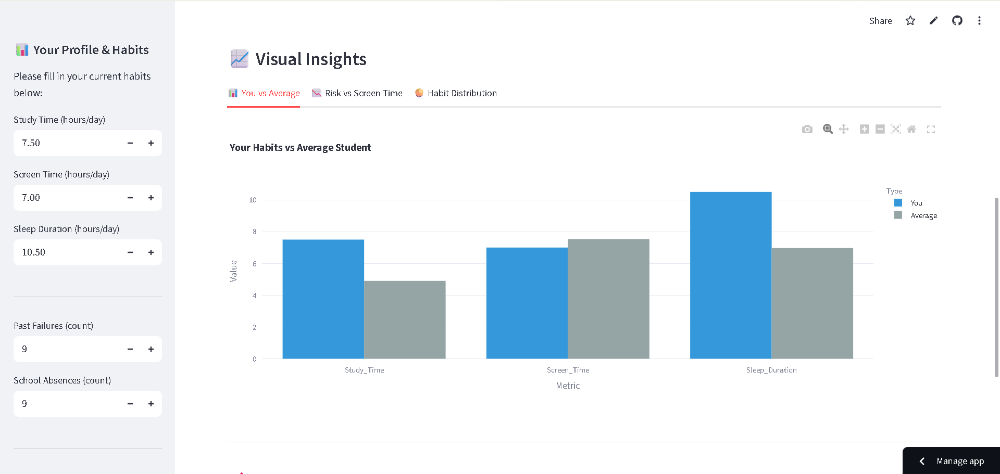
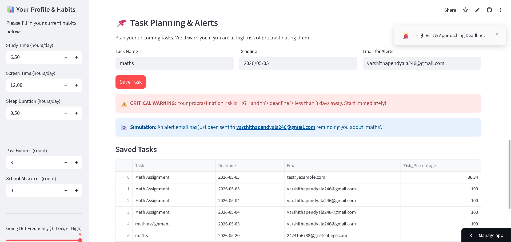

# Personalized Procrastination Prediction Model

An intelligent machine learning web application that predicts a student's procrastination risk based on academic, behavioral, and lifestyle factors. The application provides personalized recommendations and email notifications to help users improve productivity and manage tasks effectively.

## Live Demo

Try the application here: https://procrastination-dashboard-x9appkjhgu3ubytqzjw9keo.streamlit.app/

## Project Overview

Procrastination is a common challenge among students that can negatively affect academic performance. This project uses Machine Learning to analyze user inputs and predict the likelihood of procrastination. Based on the prediction, the application provides personalized suggestions to help users develop better study habits and stay on track.

## Features

- Predicts procrastination risk using a Logistic Regression model.
- Interactive and user-friendly Streamlit web application.
- Personalized productivity recommendations based on prediction results.
- Automated email notification system.
- Real-time prediction based on user inputs.
- Simple and responsive interface.

## Tech Stack

- Programming Language: Python
- Machine Learning: Scikit-learn (Logistic Regression)
- Frontend: Streamlit
- Data Processing: Pandas, NumPy
- Visualization: Matplotlib
- Database: SQLite
- Development Tools: VS Code, Jupyter Notebook

## Project Structure

procrastination-dashboard/
│── app.py
│── requirements.txt
│── tasks.csv
│── home.png
│── result.png
│── email.png
└── README.md

## How to Run the Project ?

1. Clone the repository:
   
   git clone https://github.com/Varshitha246332/procrastination-dashboard.git

2. Navigate to the project folder:
   
   cd procrastination-dashboard

3. Install the required dependencies:
   
   pip install -r requirements.txt

4. Run the Streamlit application:
   
   streamlit run app.py

## Screenshots

### Home Page

### Prediction Result

### Email Notification

## Future Enhancements

- Improve prediction accuracy using advanced machine learning models.
- Add user authentication and profile management.
- Store prediction history for users.
- Deploy with a cloud database for better scalability.
- Add interactive data visualizations and analytics.

## Team

Developed as a team project by 3 members.

## Author

Varshitha Pendyala
B.Tech in Computer Science & Engineering (Data Science)
Gokaraju Rangaraju Institute of Engineering and Technology
